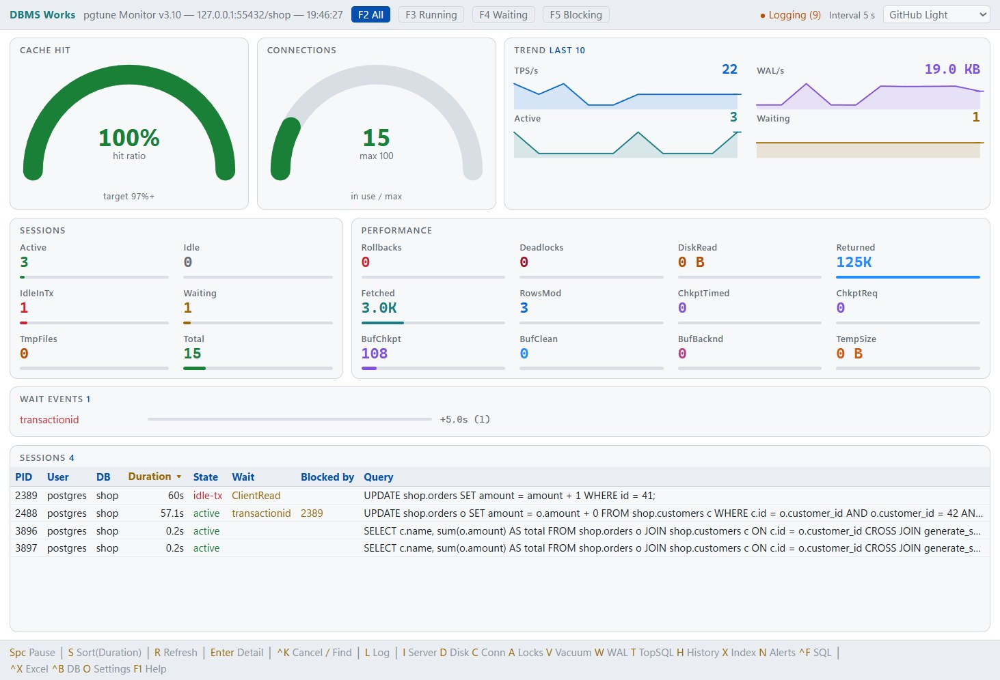
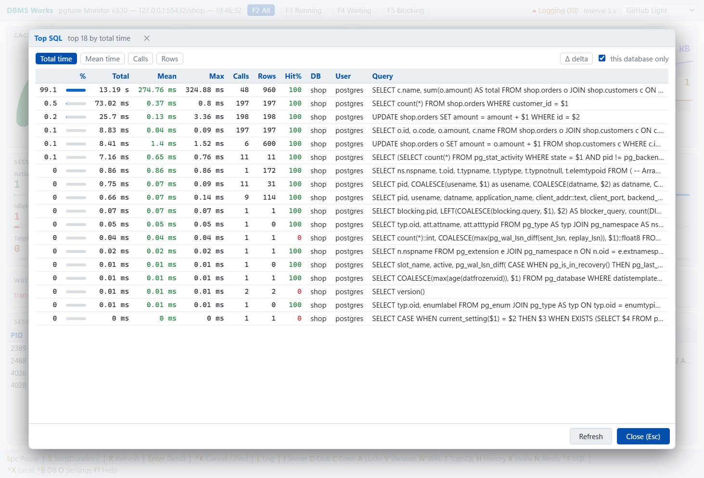
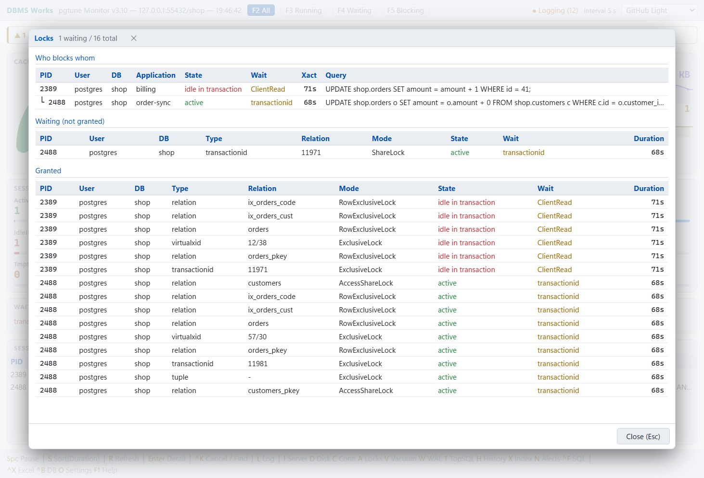
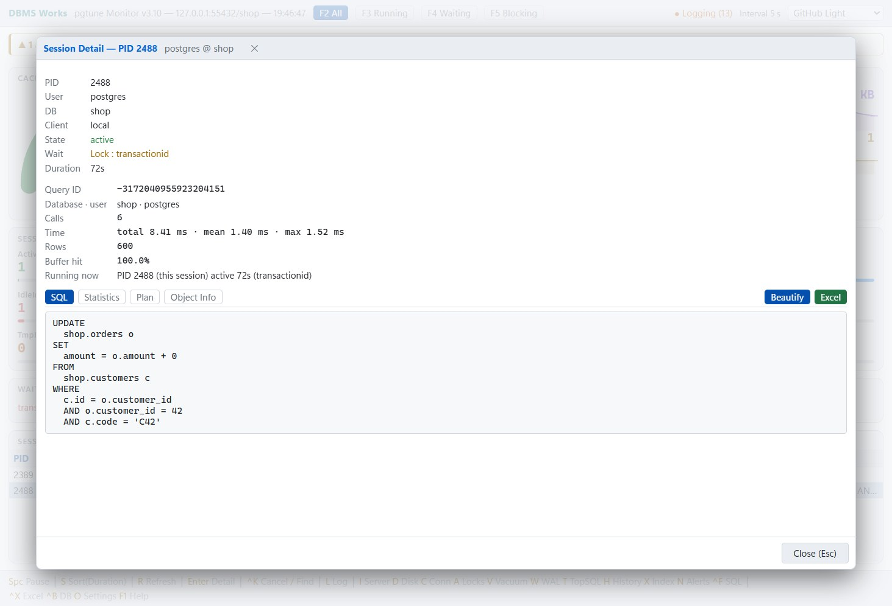
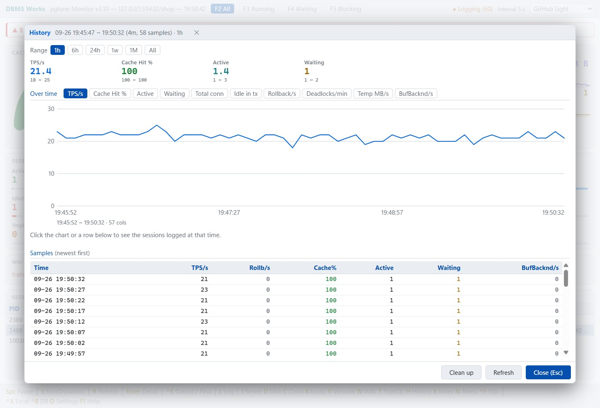
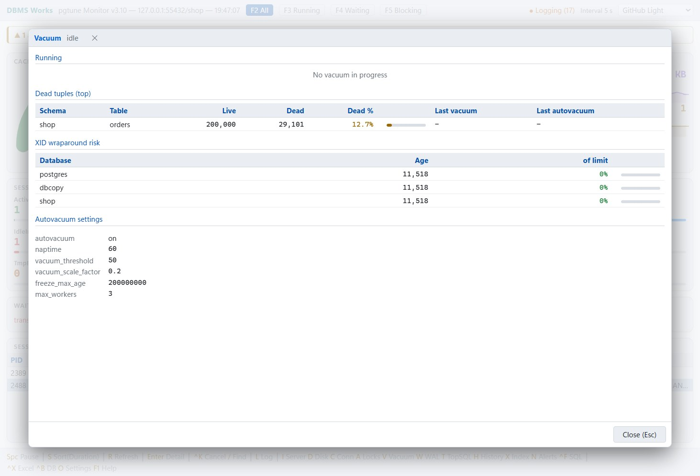
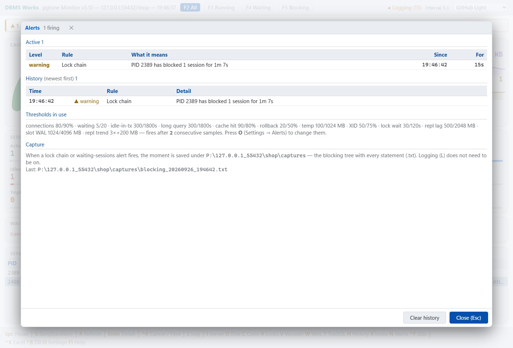
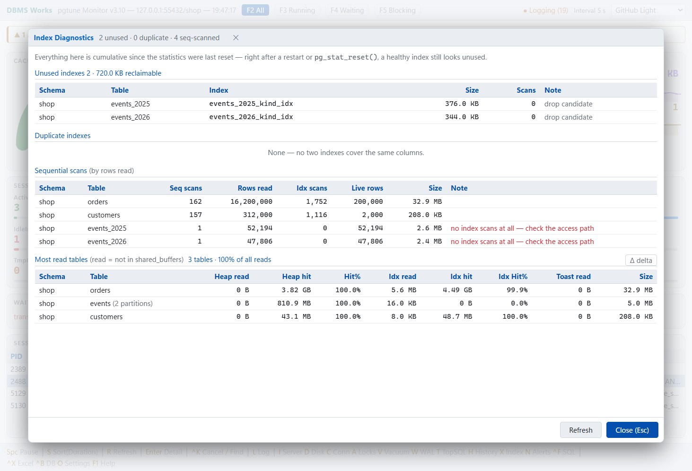

# pgtune — PostgreSQL 실시간 모니터 (무료)


**[최신 배포본 내려받기](https://github.com/Doni-Kim/pgtune-release/releases/latest)** ·
[English](README.md) · [매뉴얼 (HTML)](pgtune.html)

PostgreSQL 상태를 실시간으로 보는 모니터 툴 pgtune 을 전면 개편했습니다. 부담 없이 쓰시라고 공유드립니다.

## 화면

| 실시간 대시보드 | Top SQL |
|---|---|
|  |  |

| Lock Chain | 세션 상세 |
|---|---|
|  |  |

| History | Vacuum |
|---|---|
|  |  |

| 알림 | 인덱스 진단 |
|---|---|
|  |  |

## 설치·설정

- 압축을 풀고 폴더째 둔 뒤 `pgtune.exe` 를 실행하면 됩니다 (Single File Publishing).
- .NET 설치 불필요 — 런타임이 실행 파일에 포함되어 있습니다.
- 설정은 같은 폴더의 접속 파일만 채우면 됩니다. zip 에 `pgtuneNode1.json` · `pgtuneNode2.json` 두 개가 들어 있습니다 — 서버 하나에 파일 하나.
  서버가 하나면 한 파일만 채우고 나머지는 지우세요.

## 주요 기능

- 실시간 대시보드: 세션·성능·대기 이벤트·추이 그래프
- Top SQL(머리글을 눌러 화면에서 다시 정렬), Lock Chain, 인덱스 진단, VACUUM/XID, 복제 상태
- 임계값 알림(접속 포화·데드락·복제 지연 등)
- **History**: `L` 로 로컬 SQLite 에 모니터링 데이터를 쌓고, `H` 로 지난 흐름을 되짚습니다.
  - 구간은 1시간 / 6시간 / 24시간 / 1주 / 1개월 / 전체 중에서 고릅니다.
  - 지표는 TPS · 캐시 적중률 · Active · Waiting · 접속 수 · Idle in tx · 롤백 · 데드락 · 임시파일 · BufBackend 열 가지입니다.
  - 차트에 마우스를 올리면 그 시각의 값이 나오고, 옅은 띠로 그 구간의 최소~최대를 같이 보여 줍니다.
  - 오래된 기록은 자동으로 지웁니다(기본 지표 30일·세션 7일, 설정 파일에서 조정).
- **Object Info**: 세션 상세와 Top SQL(줄을 누르면)의 `[Object Info]` 가 실행 계획이 읽는 테이블마다 크기 · 컬럼과 통계 · 인덱스(이 계획이 쓴 것은 강조) · 파티션을 보입니다.
  계획의 조건에 나온 컬럼에 표시하고, 인덱스를 못 쓰게 하는 컬럼 형 변환은 ⚠ 로 짚습니다. 다시 실행하지 않고, 테이블은 계획에서만 가져옵니다(문장 글자로 짐작하지 않음).
- Excel 저장(`Ctrl+X`): 시트 넷 — 세션 · SQL · 계획 · Object Info. ClosedXML 기반이라 Excel 이 없어도 xlsx 파일이 저장되고, 설치돼 있으면 저장 후 자동으로 열립니다.
- **막힘 트리**: `A` 에서 누가 누구를 막는지 트리로 봅니다(판정은 `pg_blocking_pids()`). 세션 표에 Blocked by 열이 있고, `F5` 는 막는 세션과 막힌 세션을 함께 보여 줍니다.
- **세션 표**: `F2` All 은 idle 세션까지 전부(일하는 세션이 먼저, idle 은 맨 아래에 마지막으로 돌린 문장과 함께), `F3`~`F5` 는 실행 중 / 대기 / 막힘만 추립니다.
- **찾기 · 끊기**: `/` 로 세션을 글자로 거르고, `Ctrl+K` 로 쿼리만 취소하거나 접속째 끊습니다.
- **Find SQL**(`Ctrl+F`): `queryid` 를 넣으면 Top SQL 을 거치지 않고 그 문장의 통계 · 실행 계획 · Object Info 를 엽니다.
- **SQL 탭**: 상세의 첫 탭(`[SQL] [Plan] [Object Info]`)이 문장이고, 한 줄 문장은 절마다 줄을 바꿔 보여 줍니다. 따옴표 밖의 공백 · 줄바꿈만 바뀌고 글자는 바뀌지 않으며, `[Beautify]` 로 원문과 오갑니다.
- **SQL 창 한 포맷**(3.9): 세션 상세 · Top SQL · Find SQL 이 같은 창 — 요약과 지금 이 문장을 돌리는 세션, `pg_stat_statements` 를 전부 보는 `[Statistics]`, 창마다 `[Excel]`.
  `pg_stat_plans` · `pg_wait_sampling` · `pg_stat_kcache` 가 깔려 있으면 계획 이력 · 대기 분포 · OS 수치도 보입니다. 실행 계획의 노드 줄에 색이 붙습니다(빨강은 큰 테이블의 Seq Scan 만).
- **알림이 켜지는 순간**: 막힘 트리와 얽힌 문장을 `captures\` 아래 파일로 남기고, 위험 알림은 창이 앞에 없을 때 작업 표시줄 깜빡임 · Windows 알림으로 알려 줍니다.
- History 에서 한 시점을 누르면 그때 기록된 세션이 나옵니다.
- 로그 · Excel · 캡처는 서버별로 exe 옆 `{호스트_포트}\{DB명}\` 에 들어갑니다.
- **Most read tables**(Index, `X`): `shared_buffers` 밖에서 많이 읽힌 테이블 — 파티션은 합쳐서, 보이는 줄들이 전체 읽기의 몇 % 인지 함께. `Δ delta` 로 기준선 이후에 읽힌 테이블만.
- `sslMode` 의 `verify-ca` · `verify-full` 을 실제 SSL 서버로 확인했고, 인증서가 거부되면 접속 창에 무엇을 바꾸면 되는지 나옵니다(Windows 저장소에 CA 넣기 또는 `PGSSLROOTCERT`).
- **Admin Functions & Commands**: `F1` 의 두 번째 탭에서 PostgreSQL 관리 함수(`pg_terminate_backend` · `pg_reload_conf` · `pg_wal_lsn_diff` …)를 글자를 칠 때마다 찾습니다.
  목록 · 인자 · 설명은 접속한 서버에서 읽어(확장이 더한 함수 포함) 서버 버전과 늘 맞고, 자주 쓰는 70개에는 복사해 쓰는 샘플이 있습니다 — pgtune 은 실행하지 않습니다. 인터넷이 필요 없습니다.
- **관리 명령문**: 같은 탭에 SQL Server 의 DBCC 에 해당하는 관리 명령문 21개가 있습니다 — `VACUUM` · `ANALYZE` · `REINDEX` · `CLUSTER` · `CHECKPOINT` · `ALTER SYSTEM` · `CREATE INDEX CONCURRENTLY` …
  잡는 락 · 트랜잭션 안에서 도는지 · 필요한 권한과 함께, amcheck 의 무결성 점검도 있습니다.
- **서버마다 설정 파일 하나**: exe 옆에 둘 이상이면 시작할 때 어느 것으로 붙을지 고르는 창이 뜹니다.
- **설정 창**: `O` 로 수집 주기(3~60초, 기본 5초) · 로그 보관 · Top SQL · Excel · 알림 임계값 · `L` 로깅이 남길 세션을 화면에서 고칩니다.
  값을 검사한 뒤 지금 쓰는 설정 파일에 저장하고 바로 적용합니다. 접속 정보는 시작 접속 창에서만 바꿉니다.
- **테마 12종**: 밝은 6 · 어두운 6, 기본은 GitHub Light. 상단 바에서 고릅니다.
- **시작할 때 서버가 응답하지 않으면**: 20초 남짓 빈 화면 대신, 누구에게 몇 초째 붙는 중인지 보이는 작은 창이 뜨고 Cancel 로 접속 정보를 고칠 수 있습니다.
- `F1` 을 누르면 단축키 도움말이, 한 번 더 누르면 Admin Functions & Commands 탭이 나옵니다.

자세한 사용법은 첨부한 `pgtune.html` 문서를 참고해 주세요. 사용상 제한 없습니다.

## 제약사항

- UI 가 Web 기반(Blazor Hybrid)이라 Windows 전용입니다. Linux·macOS 에서는 단독 실행되지 않습니다.
- 코드는 ConfuserEx 로 난독화(무료 툴이라 강력한 수준은 아닙니다).

## 화면이 안 뜬다면 (WebView2)

창은 뜨는데 내용이 백지라면 WebView2 런타임이 없는 경우입니다.

- **Windows 11**: OS 에 기본 내장이라 항상 있습니다.
- **Windows 10**: 2021년 이후 Windows Update 로 대부분 자동 배포됐지만, 업데이트를 오래 안 한 PC 나 LTSC 같은 특수 에디션에는 없을 수 있습니다.
- **Windows Server (2016/2019/2022)**: 기본 미포함인 경우가 많아 별도 설치가 필요할 수 있습니다.

없으면 Microsoft 의 "에버그린 독립형 설치 프로그램"(`MicrosoftEdgeWebView2RuntimeInstallerX64.exe`)을 설치하시면 됩니다.
→ https://developer.microsoft.com/microsoft-edge/webview2/

## 문제가 생기면

오류가 나면 실행 파일 옆에 `pgtune.log` 가 생깁니다.

- **버그 · 질문**: [Issues](https://github.com/Doni-Kim/pgtune-release/issues) 에 남겨 주세요.
  로그 파일은 거기에 올리지 마세요 — 비밀번호는 없지만 서버 주소와 SQL 문장이 들어 있을 수 있습니다.
- **로그 파일**이나 공개하기 어려운 내용은 메일로 보내 주세요: **doniikim@gmail.com**

## 기술 스택

- .NET 11.0 (x64), C# 15, Blazor Hybrid
- 패키지: Npgsql · Microsoft.Data.Sqlite · ClosedXML · Microsoft.Web.WebView2 · Microsoft.AspNetCore.Components.WebView.WindowsForms
- 실행 파일에 묶인 위 오픈소스들의 저작권 고지 · 라이선스 전문: [THIRD-PARTY-NOTICES.txt](THIRD-PARTY-NOTICES.txt) (zip 안에도 들어 있습니다)

## 접속 파일 예시 (`pgtuneNode1.json` …)

서버마다 파일 하나, 이름은 자유입니다(`prod.json` · `dev.json` …). `pgtune.exe` 옆에 둘 이상이면 시작할 때 고르는 창이 뜨고
(목록에는 `user@server:port/database` 만 — 비밀번호는 보이지 않습니다), 하나뿐이면 바로 붙습니다.
고른 파일이 그 실행의 설정이 되어 암호화된 비밀번호 · 창 위치 · 테마가 그 파일에 저장됩니다.
같은 폴더의 pgtune 은 한 번에 하나만 뜨니, 여러 서버를 동시에 보려면 폴더를 나누세요.

```json
{
  "databases": [
    {
      "userId": "postgres",
      "password": "postgres",
      "server": "127.0.0.1",
      "port": "5432",
      "database": ""
    }
  ],
  "interval": 5
}
```

- `password` 는 평문으로 적으면 첫 실행 때 자동 암호화됩니다.
- `database` 를 비워 두면 접속한 뒤 DB 를 고르는 화면이 뜹니다.
- `interval` 은 수집 주기(초)입니다. 3~60, 적지 않으면 5.
- `alerts`, `topSql`, `logRetention`, `logFilter`(`L` 로깅이 남길 세션) 같은 절은 적지 않아도 됩니다. 프로그램을 닫을 때 기본값으로 채워 넣어 주고, `O` 로 화면에서 고칠 수 있습니다.

## 모니터링 전용 계정

superuser 가 아니어도 됩니다. 아래 권한이면 모든 화면이 superuser 와 같게 보입니다.

```sql
CREATE ROLE pgtune_monitor LOGIN PASSWORD '...';
GRANT pg_monitor TO pgtune_monitor;          -- 다른 사용자 세션 · 쿼리 · 크기 · 설정
GRANT pg_signal_backend TO pgtune_monitor;   -- Ctrl+K(쿼리 취소 · 접속 끊기)가 필요할 때만
```

`pg_monitor` 가 없으면 PostgreSQL 이 다른 사용자 세션을 가립니다. pgtune 은 빈 화면처럼 보이지 않게
세션 목록 · Connections · Locks 위에 "N sessions of other users are hidden — grant pg_monitor …" 로 알려 줍니다.

## 사용 조건

업무든 개인이든 자유롭게 쓰셔도 됩니다. 실행 파일 재배포와 리버스 엔지니어링은 삼가 주세요.
소스는 공개하지 않습니다.

## 연락처

DBMS Works — **doniikim@gmail.com**

Oracle → PostgreSQL / MySQL 마이그레이션, DB 성능 튜닝 문의도 받습니다.
