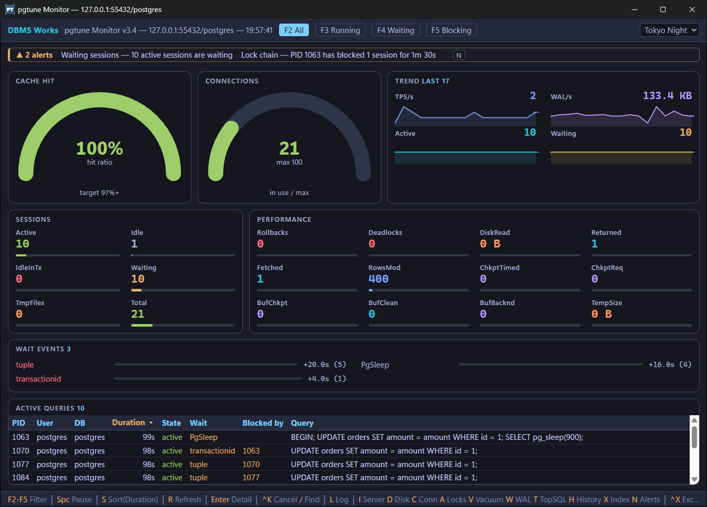
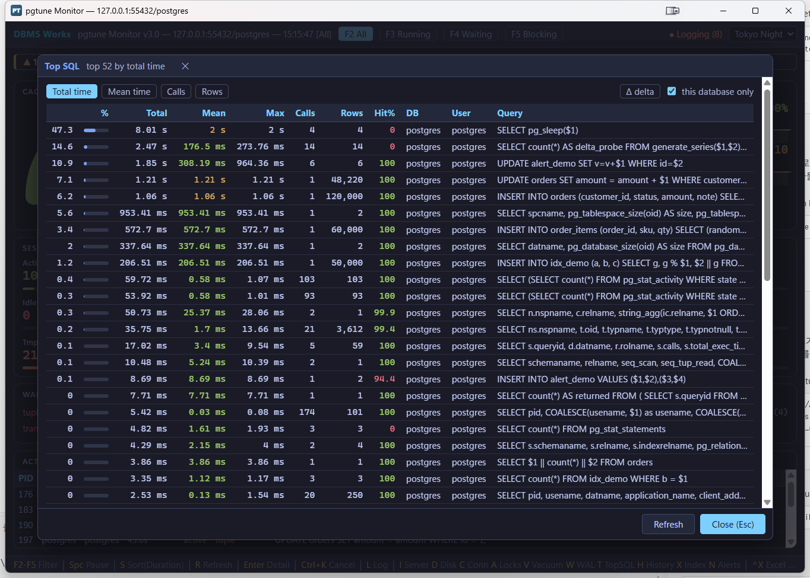
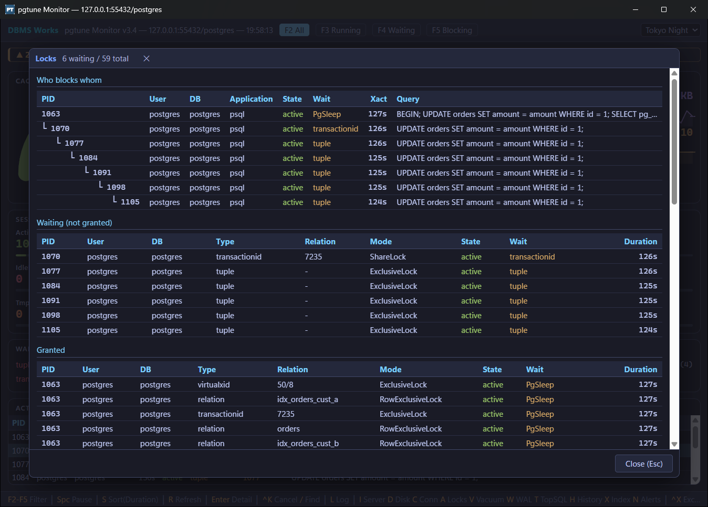
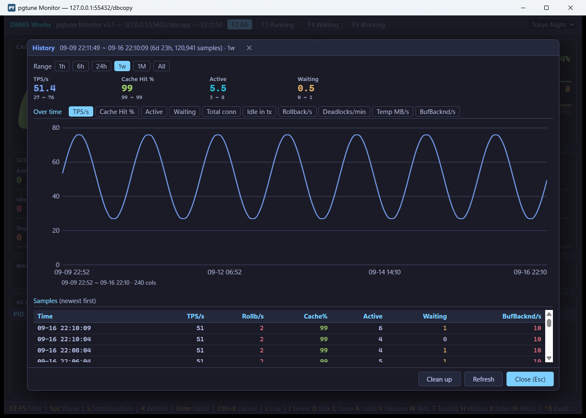
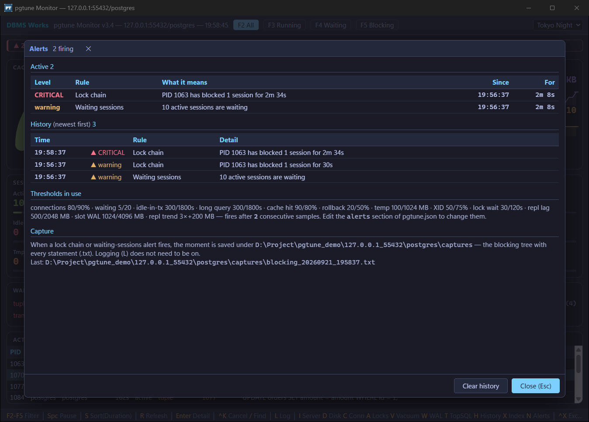

# pgtune — a real-time PostgreSQL monitor (free)


**[Download the latest release](https://github.com/Doni-Kim/pgtune-release/releases/latest)** ·
[한국어 설명](README.ko.md) · [Manual (Korean, HTML)](pgtune.html)

pgtune is a desktop monitor for PostgreSQL. This release is a full rewrite of the UI and the
diagnostics behind it. Free to use, no strings attached.

## Screenshots

| Live dashboard | Top SQL |
|---|---|
|  |  |

| Lock chains | History |
|---|---|
|  |  |



## Install

- Unzip, keep the folder together, and run `pgtune.exe` (single-file publish).
- No .NET install needed — the runtime is inside the executable.
- The only thing to set up is a connection file next to the executable. The zip ships two, `pgtuneNode1.json` and
  `pgtuneNode2.json` — one file per server. Watching a single server? Fill in one and delete the other.

## What it does

- **Live dashboard** — sessions, throughput, wait events, trend graphs.
- **Panels** — Top SQL (click a column header to re-sort what is on screen), lock chains, index diagnostics, VACUUM/XID, replication status.
- **Alerts** — connection saturation, deadlocks, replication lag and more, with your own thresholds.
- **History** — press `L` to log every snapshot into a local SQLite file, then `H` to look back.
  - Ranges: 1 hour / 6 hours / 24 hours / 1 week / 1 month / all.
  - Ten metrics: TPS, cache hit ratio, active, waiting, total connections, idle in transaction,
    rollbacks, deadlocks, temp file throughput, buffers written by backends.
  - Hover the chart to read the value at that moment; the shaded band shows the min–max of each column.
  - Old rows are trimmed automatically (30 days of metrics, 7 days of sessions by default; configurable).
- **Object Info** — in the session detail and in Top SQL (click a row), `[Object Info]` shows every table the execution plan reads: size, columns with their
  statistics, indexes (the ones this plan uses are highlighted) and partitions. Columns in the plan's conditions are marked, and a cast
  on a column — which keeps an index from being used — is flagged. Nothing is run again; tables are taken from the plan, never guessed.
- **Excel export** (`Ctrl+X`) — four sheets: session, SQL, plan and the same Object Info. Built on ClosedXML, so the `.xlsx` is written even without Excel installed,
  and opens automatically when Excel is there.
- **Blocking tree** — `A` shows who blocks whom as a tree (decided by `pg_blocking_pids()`); the session list has a
  Blocked by column, and `F5` shows blockers together with the sessions they block.
- **Session list** — `F2` All shows every session, idle ones included (working sessions first, idle at the bottom with the last statement they ran); `F3`–`F5` narrow it to running / waiting / blocking.
- **Find and stop** — `/` filters the session list by text; `Ctrl+K` cancels the query or terminates the connection.
- **Find SQL** (`Ctrl+F`) — type a `queryid` to open that statement's statistics, plan and Object Info without going through Top SQL.
- **SQL tab** — the statement is the first tab of the detail (`[SQL] [Plan] [Object Info]`), and a one-line statement is laid out by clause. Only spaces and line breaks outside quotes change, never a character; `[Beautify]` switches to the original and back.
- **When an alert fires** — the blocking tree and the statements involved are saved to a file under `captures\`,
  and a Critical alert flashes the taskbar and shows a Windows notification when the window is not in front.
- In History, click a point in time to see the sessions that were logged at that moment.
- Logs, Excel files and captures are kept per server, in `{host_port}\{database}\` next to the executable.
- **Most read tables** (Index, `X`) — which tables are read from outside `shared_buffers`, partitions added up, with
  how much of all reads the rows account for; `Δ delta` shows only what was read since a baseline you set.
- `sslMode` `verify-ca` / `verify-full` are checked against a real SSL server; when a certificate is rejected the
  connection dialog says what to change (trust the CA in the Windows store or set `PGSSLROOTCERT`).
- **Admin functions** — the second `F1` tab finds PostgreSQL admin functions as you type (`pg_terminate_backend`,
  `pg_reload_conf`, `pg_wal_lsn_diff` …). The list, arguments and descriptions are read from the connected server,
  functions added by extensions included, so they always match its version. 70 of the most used come with a sample
  to copy — pgtune never runs them. No internet needed.
- **Admin commands** — the same tab lists 21 admin SQL commands, PostgreSQL's counterpart of SQL Server's DBCC:
  `VACUUM`, `ANALYZE`, `REINDEX`, `CLUSTER`, `CHECKPOINT`, `ALTER SYSTEM`, `CREATE INDEX CONCURRENTLY` … with the lock each
  takes, whether it can run in a transaction and the permission it needs; plus amcheck's integrity checks.
- **One settings file per server** — with two or more next to the executable, pgtune asks which one to use at startup.
- **Settings screen** — `O` changes the collection interval (3–60 s, 5 by default), log retention, Top SQL, Excel, alert
  thresholds and which sessions `L` logs. Values are checked, saved to the settings file in use and applied at once;
  the connection itself is changed only in the startup window.
- **12 themes** — six light, six dark, GitHub Light by default; pick one from the top bar.
- **Server not answering at startup** — a small window shows whom pgtune is connecting to and for how long, with
  Cancel to fix the connection, instead of an empty screen for 20-odd seconds.
- Press `F1` for the keyboard shortcuts, and again for the Admin Functions & Commands tab.

The bundled `pgtune.html` is the full manual (in Korean).

## Requirements and limits

- **Windows only.** The UI is web-based (Blazor Hybrid), so it does not run standalone on Linux or macOS.
- PostgreSQL 14 and newer.
- The code is obfuscated with ConfuserEx — a free tool, so do not expect strong protection.

## Blank window? (WebView2)

If the window opens but stays blank, the WebView2 runtime is missing.

- **Windows 11** — built into the OS, always present.
- **Windows 10** — shipped through Windows Update since 2021, so it is there on most machines.
  A PC that has not been updated in a long time, or a special edition such as LTSC, may not have it.
- **Windows Server (2016/2019/2022)** — often not included; install it separately.

Install Microsoft's "Evergreen Standalone Installer"
(`MicrosoftEdgeWebView2RuntimeInstallerX64.exe`) from
https://developer.microsoft.com/microsoft-edge/webview2/

## If something breaks

Errors are written to `pgtune.log` next to the executable.

- **Bugs and questions** — open an [issue](https://github.com/Doni-Kim/pgtune-release/issues).
  Please do not attach the log there: it holds no passwords, but it can contain server addresses and SQL text.
- **The log file**, or anything you would rather not post in public — mail it to **doniikim@gmail.com**.

## Built with

- .NET 11.0 (x64), C# 15, Blazor Hybrid
- Npgsql · Microsoft.Data.Sqlite · ClosedXML · Microsoft.Web.WebView2 · Microsoft.AspNetCore.Components.WebView.WindowsForms
- Copyright notices and license texts of these bundled components: [THIRD-PARTY-NOTICES.txt](THIRD-PARTY-NOTICES.txt) (also inside the zip)

## Connection files (`pgtuneNode1.json` …)

One file per server, and any name works (`prod.json`, `dev.json` …). With two or more next to `pgtune.exe`, pgtune asks
which one to use at startup — the list shows `user@server:port/database`, never the password. With just one, it connects
straight away. The chosen file is that run's settings: the encrypted password, window position and theme are saved to it.
Only one pgtune runs per folder; to watch several servers at the same time, use one folder per server.

```json
{
  "databases": [
    {
      "userId": "postgres",
      "password": "postgres",
      "server": "127.0.0.1",
      "port": "5432",
      "database": ""
    }
  ],
  "interval": 5
}
```

- Write `password` in plain text — it is encrypted on the first run and stored back.
- Leave `database` empty to pick a database from a list after connecting.
- `interval` is the collection interval in seconds, 3–60 (5 when left out).
- Sections such as `alerts`, `topSql`, `logRetention` and `logFilter` (which sessions `L` logs) are optional.
  pgtune fills them in with defaults when it closes, and `O` edits them on screen.

## Monitoring account

A superuser is not required. These two grants make every screen show the same as for a superuser:

```sql
CREATE ROLE pgtune_monitor LOGIN PASSWORD '...';
GRANT pg_monitor TO pgtune_monitor;          -- other users' sessions and queries, sizes, settings
GRANT pg_signal_backend TO pgtune_monitor;   -- only if you want Ctrl+K (cancel a query / terminate a connection)
```

Without `pg_monitor`, PostgreSQL hides other users' sessions. pgtune says so instead of looking empty —
"N sessions of other users are hidden — grant pg_monitor …" above the session list, Connections and Locks.

## Terms

Free to use, at work or at home. Please do not redistribute the binary or reverse-engineer it.
The source is not published.

## Contact

DBMS Works — **doniikim@gmail.com**

Also available for Oracle → PostgreSQL / MySQL migration and database performance tuning work.
